# 介绍

[SIPx][] 是传统电话(POTS)与互联网实时音视频(RTC)之间的语音媒体连接器。

它以多人音视频通话+电话互通，和低延时移动端通话+电话互通两大场景化方案，通过云服务向开发者开放， 致力于帮助开发者快速搭建低成本、低延时、高品质的移动音视频与 VoIP 话路互通解决方案。

--8<-- "includes/official_site.md"

## 架构

!!! summary
    [SIPx][] 提供了将电话呼叫加入到 RTC 系统的能力。开发者可视之为 RTC 终端用户的 ==电话代理==。

    也就是说，[SIPx][] 将电话呼叫的语音作为 RTC 系统的一个有音频无视频客户端，并像其它普通客户端一样，加入到一对一对话，或者多人房间。
    而其它客户端，无论小程序或App都与 [SIPx][] 无关，它们只需照常进行音视频对话或会议，就可与电话呼叫的音频打通连接。

!!! important
    [SIPx][] **不提供电话线路**。用户可以选择：

    - 使用 SIM 卡无线语音网关，将它注册到 [SIPx][]
    - 使用第三方 VoIP 服务商提供的线路，将它与 [SIPx][] 对接

## 支持的 RTC 云服务

<!-- markdownlint-disable line-length no-empty-links -->
|                         实时音视频系统                          |           支持情况           |
| --------------------------------------------------------------- | ---------------------------- |
| [阿里云音视频通信 RTC](https://www.aliyun.com/product/rtc)      | :construction: 开发中        |
| [腾讯云实时音视频 TRTC](https://cloud.tencent.com/product/trtc) | :ballot_box_with_check: 支持 |
| [声网](https://www.agora.io/)                                   | :calendar: 规划中            |
<!-- markdownlint-enable -->

## 技术特点

OpenAPI

:   [OpenAPI][] 规范 (OAS) 为 RESTful API 定义了语言无关的标准接口，它是目前最流行、最完整的 WebAPI 生态之一。

    [SIPx][] 的 WebAPI 遵循 [OpenAPI][] `3.0` 规范，定义了简单易用的接口：
    一个 HTTP POST 即可完成电话呼叫、RTC 进房等一套操作。

    依托于 [OpenAPI][] 完善的生态，各种主流开发语言/框架都能很好的兼容；开发者可以使用 [Swagger][], [Postman][] 等工具方便的进行开发调试、乃至自动代码生成。

SIP

:   [SIP][] 是传统电话领域 VoIP 应用的行业标准，通过该协议可在 IP 网络上实现实时音视频通信。

    [SIPx][] 使用 [SIP][] 协议与 VoIP 软硬件系统通信，无需额外的 PSTN 线路。

    支持标准 [SIP][] 协议的软硬件均可与 [SIPx][] 无缝对接，如：

    - IMS
    - [昆石][] VOS
    - [openSIPS][]
    - [Kamailio][]
    - [毅航][] ISX
    - [Asterisk][]
    - [FreeSWITCH][]
    - [linphone][]
    - 多种 SIM 卡 VoIP 网关
    - 多种 VoIP 电话
    - ...

    [SIPx][] 支持 G.711(A-Law, μ-Law), G.729, iLBC 等多种音频编码。

## 安全

接口安全

:   - WebAPI 的请求-回复数据通过 HTTPS 加密传输。
    - WebAPI 采用基于 HMAC-SHA256、带有时间戳的非对称加密验证算法。

号码安全

:   [SIPx][] 集成全球号码数据库，国内用户默认仅允许呼叫中国大陆地区普通手机号码。

媒体安全

:   支持 [SRTP][] 媒体流加密传输。
